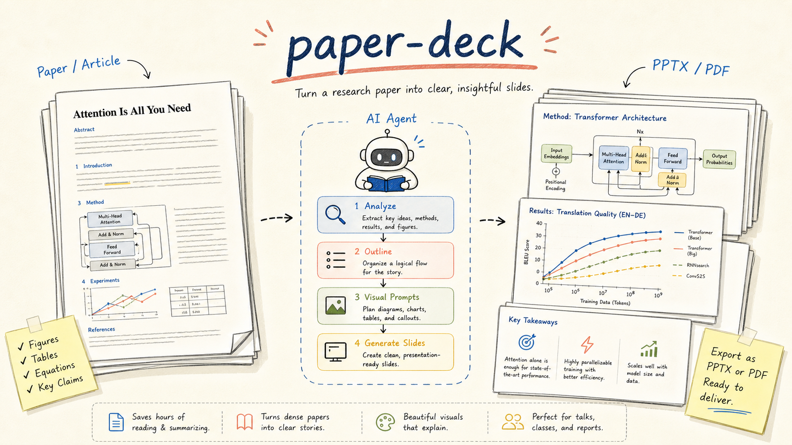
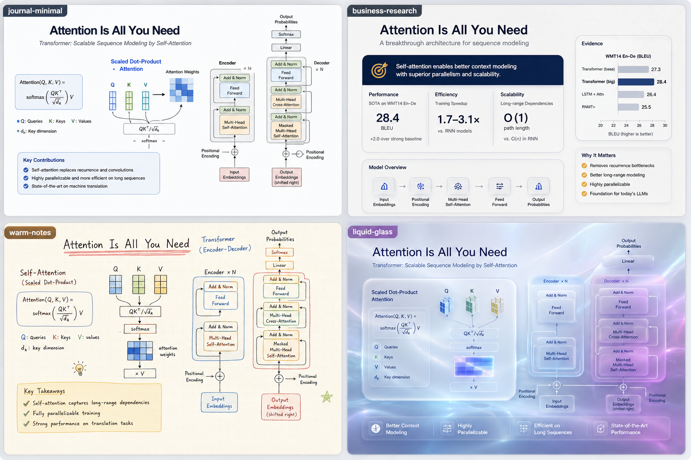
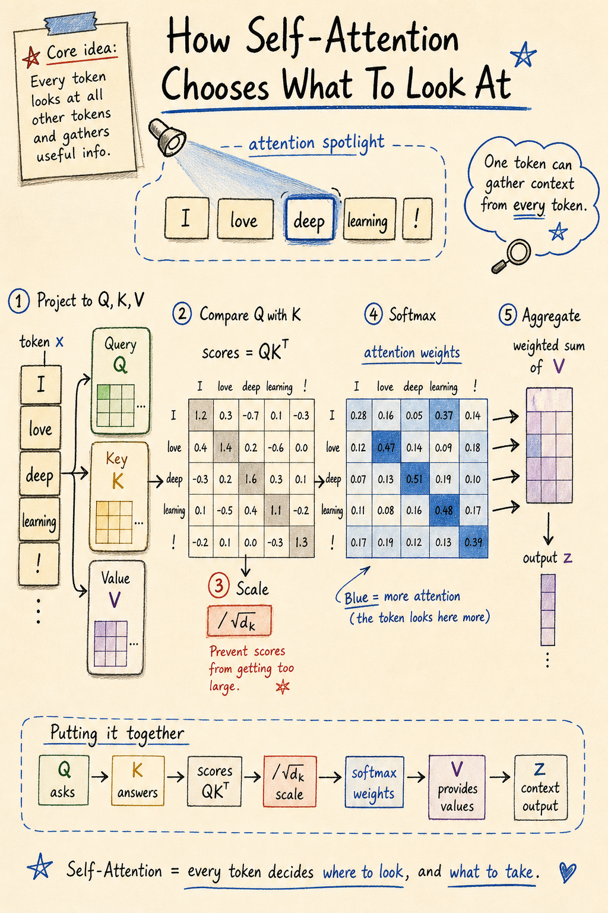

# paper-craft-skills

English | [中文](./README.zh.md)

**Turn academic papers into polished method figures, visual slide decks, in-depth articles, and multi-paper surveys — zero config, one command.**

<p align="center">
  
</p>

<p align="center">
  From arxiv link to publication-ready visuals, AIGC slide decks, deep-dive articles, and comparison surveys.<br/>
  Drop a paper, pick a style, get output that looks like a human expert made it.
</p>

---

## How to install

**Copy this into Codex or Claude Code:**

```
Please install zsyggg/paper-craft-skills for me.
GitHub: https://github.com/zsyggg/paper-craft-skills
```

That's it. The agent handles clone, symlink, and registration. **No API keys. No accounts.** If you prefer a terminal:

```bash
npx skills add zsyggg/paper-craft-skills
```

**Works with:** Codex · Claude Code · Cursor · Windsurf

---

## What's inside

<table>
<tr>
<td width="33%" align="center" valign="top">

### 🎨 paper-comic
**Paper → Method Figures**

<br/>
<sub>Transformer architecture — from <i>Attention Is All You Need</i></sub>

<br/>

Reads your paper → proposes what to draw → you confirm → generates.

| Style | Vibe |
|-------|------|
| **paper-figure** | Publication-grade diagrams |
| **sketchnote** | Bright, warm hand-drawn study notes |

</td>
<td width="33%" align="center" valign="top">

### 📄 paper-analyzer
**Paper → Deep Articles**

<br/>
<sub>Polished HTML with formulas, code, and style choice</sub>

<br/>

Reads paper → searches GitHub for code → writes in your chosen style.

| Feature | |
|---------|--|
| 🌐 Output | **HTML** — share anywhere |
| 📐 Formulas | **KaTeX** rendering |
| 📊 Diagrams | **Mermaid** charts |
| ⚡ Setup | **Zero config** |

</td>
<td width="33%" align="center" valign="top">

### 🖼️ paper-deck
**Paper → Visual Slide Deck**

<br/>
<sub>Analysis → outline → visual prompts → PPTX/PDF</sub>

<br/>

Plans the deck → generates 16:9 slide images → exports.

| Output | |
|--------|--|
| 🎞️ Slides | 16:9 visual pages |
| 📦 Export | `.pptx` + `.pdf` |
| 🛠️ Edits | Regenerate any page |

</td>
</tr>
<tr>
<td width="33%" align="center" valign="top">

### 🔬 paper-survey
**Multi-Paper → Comparison Survey** ✨ NEW

<br/>
<sub>Multiple papers → comparison figures, survey deck, or survey article</sub>

<br/>

Reads multiple papers → builds comparison matrix → generates.

| Mode | Output |
|------|--------|
| 🎨 comparison-figures | AIGC comparison diagrams |
| 🎞️ survey-deck | Comparison slides PPTX/PDF |
| 📄 survey-article | Deep comparison HTML article |

</td>
<td width="33%" align="center" valign="top">

</td>
<td width="33%" align="center" valign="top">

</td>
</tr>
</table>

---

## paper-deck — Visual slide decks that don't look like templates

`paper-deck` turns a paper, article, or technical note into a designed slide deck. It first builds a deck brief and slide-by-slide outline, then writes reproducible visual prompts, generates polished 16:9 slide images, and merges them into `.pptx` and `.pdf`.

It is built for iteration: every page has its own prompt, so you can ask for precise changes like "make slide 5 more journal-like", "replace slide 8 with a real benchmark chart", or "keep the layout but switch the cover to liquid glass".

<p align="center">
  
  <br/><sub>Four compact style presets for the same paper topic</sub>
</p>

| Style | Best for |
|-------|----------|
| **journal-minimal** | Nature/IEEE-inspired academic decks and thesis defenses |
| **business-research** | Strategy memos, industry research, investor/client briefings |
| **warm-notes** | Study-note explanations, teaching, approachable paper walkthroughs |
| **liquid-glass** | Apple-inspired visual chapters, covers, and high-impact section pages |

It also supports real source visuals. When a PDF contains strong figures, tables, plots, or screenshots, the skill plans which slides should use them, where they should be cropped, and how they should be framed.

```bash
/paper-deck https://arxiv.org/abs/1706.03762
/paper-deck /path/to/paper.pdf --style journal-minimal --slides 12
/paper-deck notes.md --style liquid-glass
```

---

## paper-comic — How it works

```text
/paper-comic https://arxiv.org/abs/1706.03762

Reads the paper, then recommends:

  I suggest 6 figures:
  1. Cover: one-line contribution + visual anchor
  2. Transformer architecture overview
  3. Self-attention mechanism
  4. Multi-head attention detail
  5. Encoder / Decoder Block
  6. Key results

  Or generate only 1 overview figure, or expand to 8 detailed mechanism figures.
  Language? [Chinese / English]  Style? [sketchnote / paper-figure]  Scope and count?
```

### Example outputs

<p align="center">
  
  <br/><b>paper-figure</b> — clean, publication-grade
</p>

<p align="center">
  
  <br/><b>sketchnote</b> — bright, warm, approachable
</p>

> Full walkthrough: [examples/paper-illustrated/attention-is-all-you-need](./examples/paper-illustrated/attention-is-all-you-need)

---

## paper-analyzer — Deep articles that read like a human expert wrote them

**Not a paper translator — a re-interpreter.** It reads the full paper, searches GitHub for open-source implementations, cross-references code with the paper, and writes in your chosen style.

### Three writing styles

<p align="center">
  
</p>

| Style | Reads like | Use it for |
|-------|-----------|------------|
| **storytelling** | A viral blog post — hooks, analogies, golden takeaway | WeChat, Twitter, blogs |
| **academic** | A peer-reviewed deep dive — KaTeX formulas, comparison tables | Lab meetings, lit reviews |
| **concise** | A cheat sheet — Mermaid diagram + key data table | Quick understanding |

### Features

<table>
<tr>
<td width="50%" align="center">
<br/>
<b>Formula Explanation</b><br/>
Extracted paper formulas with symbol-by-symbol breakdown
</td>
<td width="50%" align="center">
<br/>
<b>Code Analysis</b><br/>
Aligns paper concepts with the GitHub source code
</td>
</tr>
</table>

```bash
/paper-analyzer https://arxiv.org/abs/1706.03762     # arxiv link
/paper-analyzer /path/to/paper.pdf                     # local PDF
/paper-analyzer                                         # then paste text
```

---

## paper-survey — Compare multiple papers, visually

`paper-survey` extends the same approach to **multiple papers**. It reads each paper independently, builds a structured comparison matrix across 5 dimensions (problem definition, method approach, key design, experimental results, trade-offs), and generates:

| Mode | Output | Use case |
|------|--------|----------|
| **comparison-figures** | AIGC comparison diagrams (PNG) | Quick team overview, tech selection |
| **survey-deck** | 16:9 comparison slides (PPTX/PDF) | Group meeting survey presentations |
| **survey-article** | Deep comparison HTML article | Literature review writing |

Each paper gets a consistent color across all output, differences are visually highlighted, and the comparison matrix ensures every paper is evaluated on the same dimensions.

```bash
/paper-survey https://arxiv.org/abs/1706.03762 https://arxiv.org/abs/1907.04340
/paper-survey --topic "Transformer position encoding comparison" --papers p1.pdf p2.pdf p3.pdf
/paper-survey notes.md --format article
```

---

## License

MIT

---

## Star History

[](https://star-history.com/#zsyggg/paper-craft-skills&Date)
