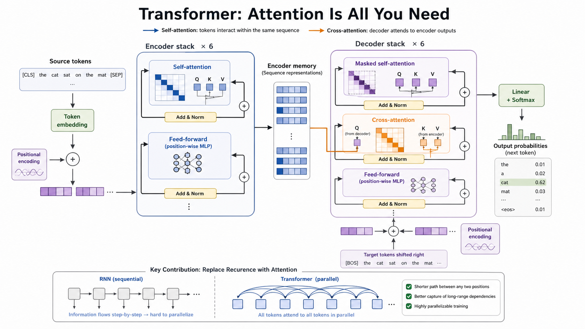

# paper-craft-skills

[English](./README.md) | 中文

**6 个 AI 学术技能：方法图解、深度长文、视觉幻灯片、多论文对比、学术海报、视觉摘要。零配置，一行命令。**

<p align="center">
  
</p>

<p align="center">
  输入 arxiv 链接，选择风格，输出像人类专家手笔的图解、PPT、文章、综述、海报和摘要。
</p>

---

## 怎么安装

**把这段话复制到 Codex 或 Claude Code 里：**

```
请帮我安装 zsyggg/paper-craft-skills
GitHub：https://github.com/zsyggg/paper-craft-skills
```

AI agent 会自动克隆、配置、注册 skill。**不需要 API key，不需要注册账号。**

```bash
npx skills add zsyggg/paper-craft-skills
```

**支持：** Codex · Claude Code · Cursor · Windsurf

---

## 六个技能

### 🎨 paper-comic — 论文 → 方法图解
读完论文 → 推荐画什么 → 你确认 → 生成。支持 paper-figure（论文级专业图表）和 sketchnote（手抄报风）。

### 📄 paper-analyzer — 论文 → 深度长文
读完论文全文 → 搜索 GitHub 源码 → 按你选的风格写作。支持 storytelling / academic / concise 三种风格，KaTeX 公式 + Mermaid 图表 + 深色模式。

### 🖼️ paper-deck — 论文 → 视觉幻灯片
规划 deck → 逐页 AIGC 生成 16:9 slide image → PPTX/PDF。支持 journal-minimal / business-research / warm-notes / liquid-glass 四种风格。

### 🔬 paper-survey — 多论文对比综述 ✨ 全新
逐篇独立分析 → 构建 5 维度对比矩阵 → 三模式输出：对比图解 / 综述幻灯片 / 综述长文。

### 📋 paper-poster — 论文 → 学术海报 ✨ 全新
自动提取核心内容 → 生成 300dpi AIGC 学术海报 → 可打印 PDF。支持 conference-wide / defense-poster / research-showcase 三种风格。

### 📊 paper-summary — 论文 → 一页视觉摘要 ✨ 全新
提取论文核心信息 → 生成一页 AIGC 视觉摘要。支持 infographic / card-summary / timeline-figure 三种模式。

---

## 统一 CLI

所有 6 个技能通过一个命令调用：

```bash
python3 scripts/papercraft.py list
python3 scripts/papercraft.py comic https://arxiv.org/abs/1706.03762 --style sketchnote
python3 scripts/papercraft.py deck paper.pdf --style liquid-glass --slides 12
python3 scripts/papercraft.py survey p1.pdf p2.pdf --format survey-article
python3 scripts/papercraft.py poster paper.pdf --style defense-poster
python3 scripts/papercraft.py summary paper.pdf --mode infographic
```

---

## 安装依赖

```bash
pip install Pillow python-pptx
```

可选：`pip install markdown pypdf2`

---

## 技能详情

### paper-comic

```text
/paper-comic https://arxiv.org/abs/1706.03762

建议：6 张图
1. 封面图
2. 方法总览
3. Self-attention 机制
4. Multi-head attention 细节
5. Encoder / Decoder Block
6. 关键结果
```

### paper-analyzer

三种写作风格 + 深色模式。自动搜索 GitHub 开源代码，交叉引用。

### paper-deck

四种风格预设：journal-minimal / business-research / warm-notes / liquid-glass。支持真实 PDF 截图嵌入。

### paper-survey

5 维度对比框架：问题定义、方法路径、关键设计、实验表现、适用边界。每篇论文固定颜色。

### paper-poster

300dpi 可打印输出。48×36 in（conference-wide）或 36×48 in（defense-poster）。自动超分 + PDF 导出。

### paper-summary

三种模式适配不同场景：信息图（竖版2:3）、卡片（1:1方卡）、演进图（16:9横版）。

---

## 示例

- [Transformer 位置编码对比综述](./examples/paper-survey/transformer-position-encoding)
- [Attention Is All You Need 图解](./examples/paper-illustrated/attention-is-all-you-need)

---

MIT
