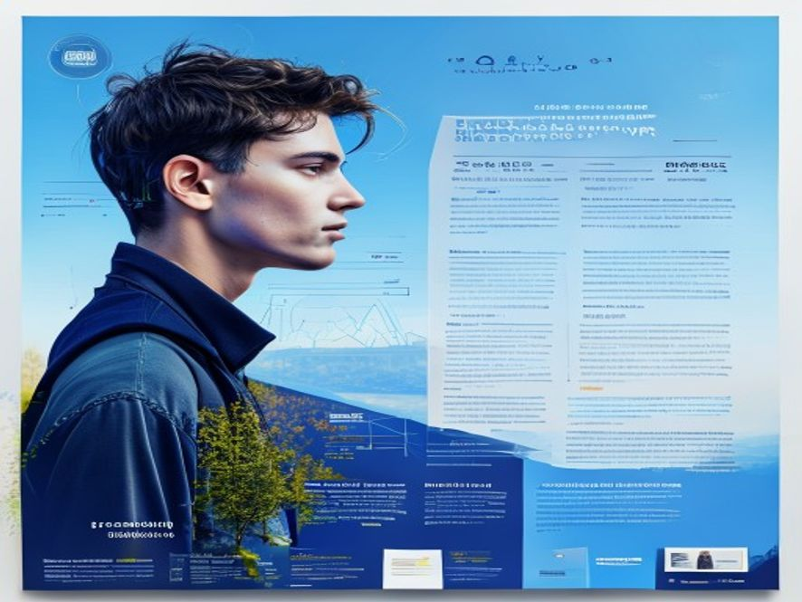

# paper-poster 示例：Attention Is All You Need

**conference-wide 学术海报** — 48×36 会议展板。

## 实际生成效果



## 快速开始

```bash
/paper-poster https://arxiv.org/abs/1706.03762 --style conference-wide
```

## 完整工作流产出

| 文件 | 说明 |
|------|------|
| `poster-brief.md` | Step 1-2：设计 Brief |
| `prompt-poster.md` | Step 3-4：最终可执行生图 prompt |
| `images/poster-conference.png` | Step 5：AIGC 生成的实际图片 ✅ |
