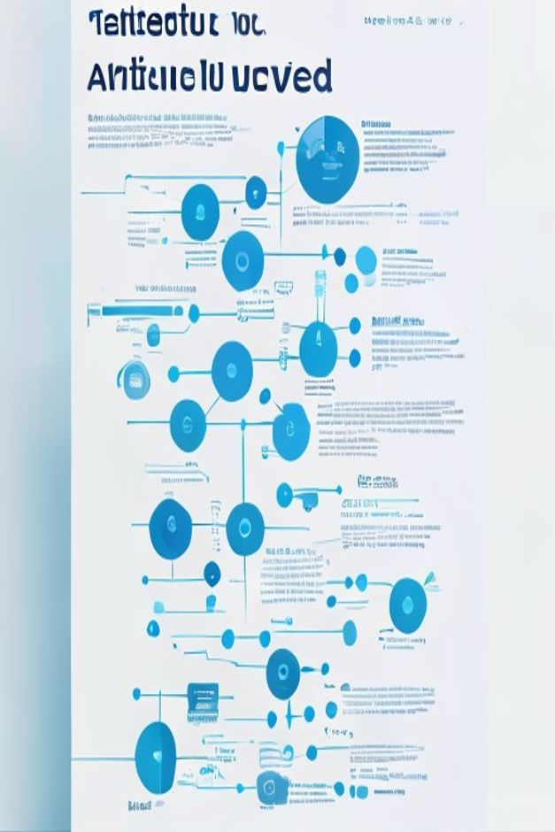

# paper-summary 示例：Attention Is All You Need

**信息图模式** — 竖版 2:3，一页看懂 Transformer。

## 实际生成效果



## 快速开始

```bash
/paper-summary https://arxiv.org/abs/1706.03762 --mode infographic --language English
```

## 完整工作流产出

| 文件 | 说明 |
|------|------|
| `summary-brief.md` | Step 1-2：分析提取 + 确认记录 |
| `prompt-infographic.md` | Step 3-4：最终可执行生图 prompt |
| `images/summary-infographic.png` | Step 5：AIGC 生成的实际图片 ✅ |
