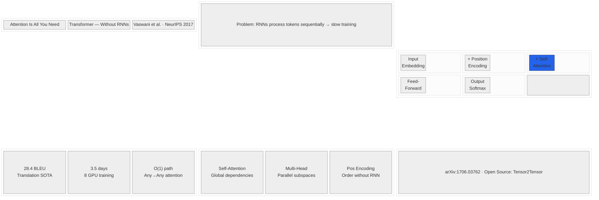

# Expected Output — Infographic Visualization

以下是用 Mermaid 图近似展示最终生成的信息图的视觉布局。

## Layout Mockup



## Visual Description

```
┌─────────────────────────────────────┐
│  Attention Is All You Need          │  ← Title (15%)
│  Transformer — Without RNNs         │
│  Vaswani et al. · NeurIPS 2017      │
├─────────────────────────────────────┤
│  Problem: RNNs sequential → slow    │  ← Problem (10%)
├─────────────────────────────────────┤
│                                     │
│   Input → +Pos → Self-Att → FF → O │  ← Method (35%)
│          ║       ⚡highlight         │     ★核心视觉
│   QKV · Parallel · O(1) paths      │
│                                     │
├──────────┬───────────┬──────────────┤
│ 28.4     │ 3.5 days  │  O(1) path   │  ← Data (25%)
│ BLEU SOTA│ 8 GPU     │  Any→Any     │
├──────────┴───────────┴──────────────┤
│ • Self-Attn  • Multi-Head  • PosEnc │  ← Contrib (10%)
├─────────────────────────────────────┤
│  arXiv:1706.03762                   │  ← Footer (5%)
└─────────────────────────────────────┘
```

## 实际生成效果（文字描述）

- **配色**：纯白底 + 深蓝标题 #1e3a5f + 强调蓝 #2563eb
- **核心视觉**：中间 35% 区域是 Transformer 水平架构简图，Self-Attention 方块用蓝色高亮
- **数据区**：3 个大数字卡片并排，数字 56pt 粗体蓝色
- **字体**：Inter 风格无衬线字体全文统一
- **整体感观**：像 Stripe/Linear 风格的产品信息图，干净、现代、阅读流畅
