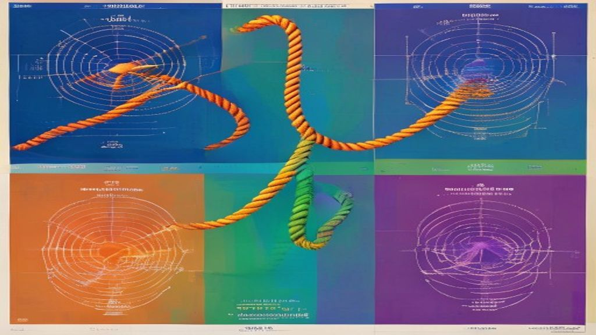
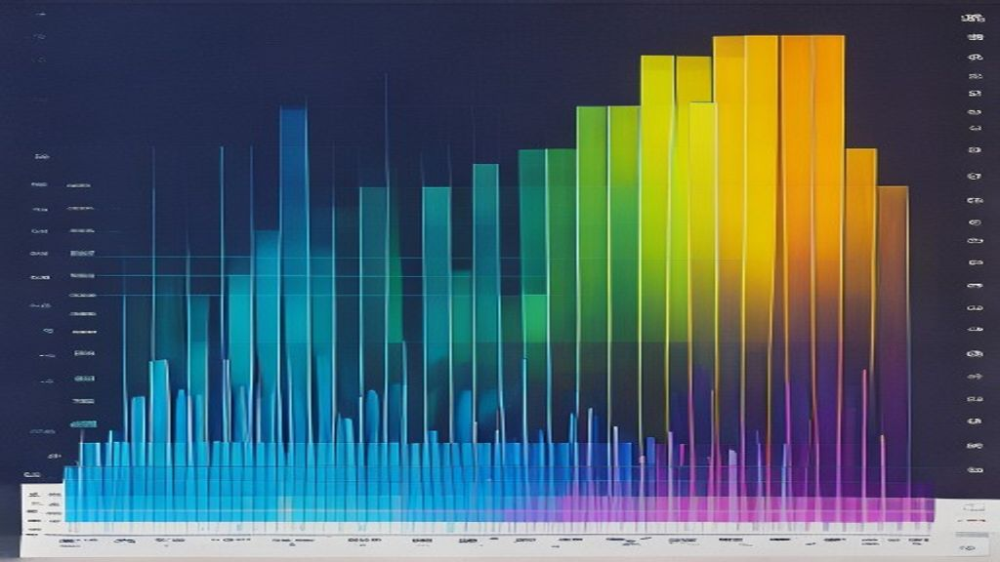
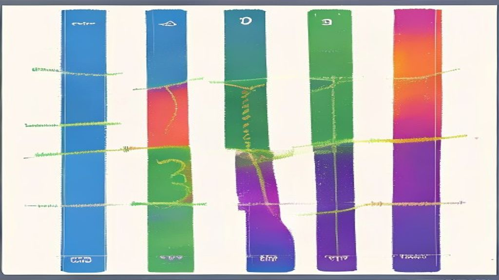

# paper-survey 示例：Transformer 位置编码对比

4 种位置编码方案的 AIGC 对比图解。

## 实际生成效果

### 对比总览


### 架构对比


### 实验对比


### 演进时间线


## 快速开始

```bash
/paper-survey --topic "Transformer position encoding" \
  --papers paper1.pdf paper2.pdf paper3.pdf paper4.pdf \
  --format comparison-figures
```

## 完整工作流产出

| 文件 | 说明 |
|------|------|
| `prompt-overview.md` | 对比总览 prompt |
| `prompt-architecture.md` | 架构对比 prompt |
| `prompt-experiments.md` | 实验对比 prompt |
| `prompt-timeline.md` | 时间线 prompt |
| `images/*.png` | AIGC 生成的 4 张实际图片 ✅ |
