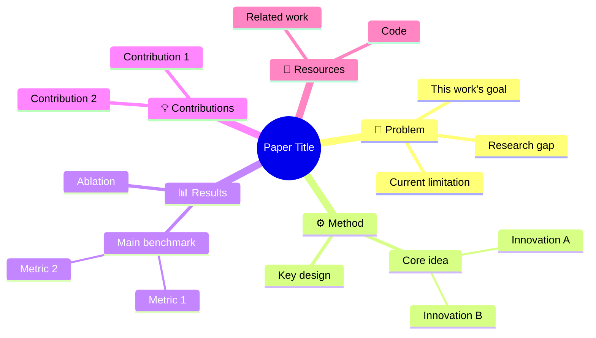

# Paper Mindmap — Paper to Visual Mind Map

把论文的核心知识组织成层级化的思维导图。

## 核心哲学

### 思维导图的核心作用是"建立理解骨架"

一张好的论文思维导图让读者：
1. **一眼看到全貌** — 论文的整体结构
2. **理解层级关系** — 核心贡献、子问题、方法细节的归属
3. **知道看论文时重点读哪里** — 高亮关键创新

### 我们不做的
- ❌ 把论文大纲直接复制成导图（没有信息增益）
- ❌ 超过 5 层深度（思维导图不是目录树）
- ❌ 每层超过 7 个节点（认知负荷过高）

---

## 两种输出模式

### Mode 1: mermaid-code

输出 Mermaid mindmap 代码，可直接嵌入任何 Markdown/HTML。

适合：README、Notion、Obsidian、GitHub 文档。

### Mode 2: aigc-mindmap

输出 AIGC 生成的思维导图图片（PNG）。

适合：分享、社交媒体、演示。

---

## 思维导图结构模板

```
                    ┌──────────┐
                    │ Paper    │
                    │ Title    │
                    └────┬─────┘
                         │
          ┌──────────────┼──────────────┐
          │              │              │
     ┌────┴────┐   ┌────┴────┐   ┌────┴────┐
     │Problem  │   │ Method  │   │ Results │
     │Definition│   │         │   │         │
     └─────────┘   └────┬────┘   └────┬────┘
                        │             │
              ┌─────────┼─────────┐   │
              │         │         │   │
         ┌────┴──┐ ┌────┴──┐ ┌────┴──┐│
         │Module │ │Module │ │Module ││
         │  A    │ │  B    │ │  C    ││
         └───────┘ └───────┘ └───────┘│
                                       │
                                 ┌─────┴─────┐
                                 │Key Numbers│
                                 │ Benchmarks│
                                 └───────────┘
```

### 标准 5 分支结构

1. **📌 Problem** — 研究问题、动机、现有局限
2. **⚙️ Method** — 核心方法、创新点、模块分解
3. **📊 Results** — 关键实验数据、Benchmark 对比
4. **💡 Contributions** — 核心贡献、理论意义
5. **🔗 Connections** — 相关工作、未来方向、代码资源

---

## 工作流

### Step 1: 分析论文

读论文后提取 5 分支的核心内容：
- 每个分支不超过 5 个子节点
- 每个节点不超过 15 个字
- 总深度不超过 4 层

### Step 2: 确认

| 确认项 | 选项 |
|--------|------|
| 模式 | mermaid-code / aigc-mindmap |
| 语言 | 中文 / English |
| 深度 | 3层（默认） / 4层 |
| 重点 | 方法驱动 / 结果驱动 / 概念驱动 |

### Step 3: 生成 Mermaid 代码



### Step 4: 生成 AIGC 图片（如果选 Mode 2）

基于 mermaid 结构写生图 prompt，生成可视化 mindmap 图片。

### Step 5: 输出

- `mindmap-brief.md` — 分析结果
- `mindmap.mmd` — Mermaid 代码
- `images/mindmap.png` — AIGC 思维导图（Mode 2）

---

## 视觉设计规则

- 根节点：论文标题，居中，最大
- 一级分支：5 个主分支，使用不同颜色的柔和色块
- 二级及以下：灰色/浅色子节点
- 连接线：圆润曲线，不是直角
- 字体：清晰无衬线
- 高亮：核心创新节点用强调色
	
## 参考

- `references/mindmap-templates.md` — 更多导图模板
